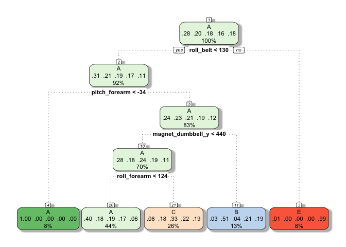
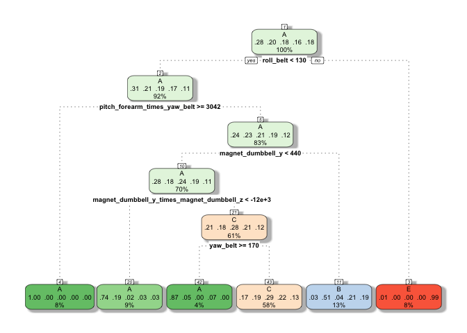

# Predicting if an exercise is done correctly using sensor data


***Summary.*** *The paper [1] describes the measurement of subjects that lift a light (1.25kg) dumbbell. Ten male persons (age 20-28) each did a series of Unilateral Dumbbell Biceps Curls. These were done in the presence of an experienced weight lifter, and each lift was done either in the correct way or in one of four incorrect ways. The data was obtained using four sensors placed on the equipment: on the dumbbell, the belt, the glove and on an armband around the upper arm. Each sensor had 9 degrees of freedom (acceleration, gyroscope and magnetometer) and was sampled at 45Hz via Bluetooth, see [1].*

*The purpose of this course project is to use such sensor readings to built a classifier that recognizes the five motion alternatives. Using a random forest classifier, we construct a method that has a comparable accuracy to a classifier mentioned in the original paper (also a random forest).*

##1. Loading and cleaning the data

The following loads the dataset provided on the course homepage:


```r
training <- read.csv("pml-training.csv", sep=",",  header = TRUE)
dim(training)
```

```
## [1] 19622   160
```

The data has 19622 rows (measurements) and 160 columns (features). It is thus smaller than the [original dataset](http://groupware.les.inf.puc-rio.br/static/WLE/WearableComputing_weight_lifting_exercises_biceps_curl_variations.csv), which has 39243 rows. Nevertheless, due to its large size, the data is most easily inspected by importing it into a spreadsheet software, or, by using R Studio's interactive `View` command. The columns divide into three types. First, there are 8 columns that record various aspects of the experimental setup. We will here develop a classifier that only uses sensor readings. We therefore discard these columns. For example, they identify the first names of the subjects. The columns are:


```r
columns_to_delete <- c('X', 'user_name', 'raw_timestamp_part_1', 'raw_timestamp_part_2', 
                    'cvtd_timestamp', 'new_window', 'num_window', 'rows')
```

Let us emphasize that the above choice removes all timing information from the data. This will result in a model that neither involve time.

The remaining `160-8=152` columns record sensor data for the exercises. The motion type is recorded in the column `classe`, which can take 5 values: A (exercise is done correctly) and B, C, D, E for the four incorrect ways of doing the exercise. The remaining columns record data on two time-scales. Some of the columns have data on all rows while others are recorded less frequently and seem to be related to various statistics. Below this is illustrated with the first 30 values for the columns `pitch_belt` and `avg_pitch_belt`:


```r
training$pitch_belt[1:30]
```

```
##  [1] 8.07 8.07 8.07 8.05 8.07 8.06 8.09 8.13 8.16 8.17 8.18 8.18 8.20 8.21
## [15] 8.20 8.15 8.12 8.08 8.06 8.07 8.10 8.09 8.10 8.10 8.11 8.09 8.11 8.14
## [29] 8.16 8.17
```

```r
training$avg_pitch_belt[1:30]
```

```
##  [1]  NA  NA  NA  NA  NA  NA  NA  NA  NA  NA  NA  NA  NA  NA  NA  NA  NA
## [18]  NA  NA  NA  NA  NA  NA 8.1  NA  NA  NA  NA  NA  NA
```

Due to this structure in the data, we simplify it by removing all non-numeric columns. We also remove the columns collected earlier in `columns_to_delete`. The only exception is the `classe`-column which is not removed. This contains the labels we aim to predict. 


```r
clean_df <- function(df) {
    # Helper function: returns TRUE if input vector has any NA:s.
    has_an_NA <- function(v) { any(sapply(v, function(x) is.na(x))) }    
    
    keep_column <- function(c_name) { 
        # Keep column with correct class labels
        if (c_name == 'classe') {
            return(TRUE)
        }
       
        # Do not keep columns already marked for deletion.
        if (c_name %in% columns_to_delete) {
            return(FALSE)
        }
       
        # Keep columns that are all numeric. Discard the rest.
        column <- df[ , as.character(c_name)]
        return(is.numeric(column) && !has_an_NA(column))
   }

   return(df[, sapply(colnames(df), keep_column )])
}  
training <- clean_df(training)
dim(training)
```

```
## [1] 19622    53
```

We have now cleaned the data, and from the original 160 columns 53 remain. For completeness, the below lists the columns that remain, and for each column the entries of the first few rows are listed. Apart from the `classe`-column, the data frame is numeric and contains no `NA`s.


```r
str(training)
```

```
## 'data.frame':	19622 obs. of  53 variables:
##  $ roll_belt           : num  1.41 1.41 1.42 1.48 1.48 1.45 1.42 1.42 1.43 1.45 ...
##  $ pitch_belt          : num  8.07 8.07 8.07 8.05 8.07 8.06 8.09 8.13 8.16 8.17 ...
##  $ yaw_belt            : num  -94.4 -94.4 -94.4 -94.4 -94.4 -94.4 -94.4 -94.4 -94.4 -94.4 ...
##  $ total_accel_belt    : int  3 3 3 3 3 3 3 3 3 3 ...
##  $ gyros_belt_x        : num  0 0.02 0 0.02 0.02 0.02 0.02 0.02 0.02 0.03 ...
##  $ gyros_belt_y        : num  0 0 0 0 0.02 0 0 0 0 0 ...
##  $ gyros_belt_z        : num  -0.02 -0.02 -0.02 -0.03 -0.02 -0.02 -0.02 -0.02 -0.02 0 ...
##  $ accel_belt_x        : int  -21 -22 -20 -22 -21 -21 -22 -22 -20 -21 ...
##  $ accel_belt_y        : int  4 4 5 3 2 4 3 4 2 4 ...
##  $ accel_belt_z        : int  22 22 23 21 24 21 21 21 24 22 ...
##  $ magnet_belt_x       : int  -3 -7 -2 -6 -6 0 -4 -2 1 -3 ...
##  $ magnet_belt_y       : int  599 608 600 604 600 603 599 603 602 609 ...
##  $ magnet_belt_z       : int  -313 -311 -305 -310 -302 -312 -311 -313 -312 -308 ...
##  $ roll_arm            : num  -128 -128 -128 -128 -128 -128 -128 -128 -128 -128 ...
##  $ pitch_arm           : num  22.5 22.5 22.5 22.1 22.1 22 21.9 21.8 21.7 21.6 ...
##  $ yaw_arm             : num  -161 -161 -161 -161 -161 -161 -161 -161 -161 -161 ...
##  $ total_accel_arm     : int  34 34 34 34 34 34 34 34 34 34 ...
##  $ gyros_arm_x         : num  0 0.02 0.02 0.02 0 0.02 0 0.02 0.02 0.02 ...
##  $ gyros_arm_y         : num  0 -0.02 -0.02 -0.03 -0.03 -0.03 -0.03 -0.02 -0.03 -0.03 ...
##  $ gyros_arm_z         : num  -0.02 -0.02 -0.02 0.02 0 0 0 0 -0.02 -0.02 ...
##  $ accel_arm_x         : int  -288 -290 -289 -289 -289 -289 -289 -289 -288 -288 ...
##  $ accel_arm_y         : int  109 110 110 111 111 111 111 111 109 110 ...
##  $ accel_arm_z         : int  -123 -125 -126 -123 -123 -122 -125 -124 -122 -124 ...
##  $ magnet_arm_x        : int  -368 -369 -368 -372 -374 -369 -373 -372 -369 -376 ...
##  $ magnet_arm_y        : int  337 337 344 344 337 342 336 338 341 334 ...
##  $ magnet_arm_z        : int  516 513 513 512 506 513 509 510 518 516 ...
##  $ roll_dumbbell       : num  13.1 13.1 12.9 13.4 13.4 ...
##  $ pitch_dumbbell      : num  -70.5 -70.6 -70.3 -70.4 -70.4 ...
##  $ yaw_dumbbell        : num  -84.9 -84.7 -85.1 -84.9 -84.9 ...
##  $ total_accel_dumbbell: int  37 37 37 37 37 37 37 37 37 37 ...
##  $ gyros_dumbbell_x    : num  0 0 0 0 0 0 0 0 0 0 ...
##  $ gyros_dumbbell_y    : num  -0.02 -0.02 -0.02 -0.02 -0.02 -0.02 -0.02 -0.02 -0.02 -0.02 ...
##  $ gyros_dumbbell_z    : num  0 0 0 -0.02 0 0 0 0 0 0 ...
##  $ accel_dumbbell_x    : int  -234 -233 -232 -232 -233 -234 -232 -234 -232 -235 ...
##  $ accel_dumbbell_y    : int  47 47 46 48 48 48 47 46 47 48 ...
##  $ accel_dumbbell_z    : int  -271 -269 -270 -269 -270 -269 -270 -272 -269 -270 ...
##  $ magnet_dumbbell_x   : int  -559 -555 -561 -552 -554 -558 -551 -555 -549 -558 ...
##  $ magnet_dumbbell_y   : int  293 296 298 303 292 294 295 300 292 291 ...
##  $ magnet_dumbbell_z   : num  -65 -64 -63 -60 -68 -66 -70 -74 -65 -69 ...
##  $ roll_forearm        : num  28.4 28.3 28.3 28.1 28 27.9 27.9 27.8 27.7 27.7 ...
##  $ pitch_forearm       : num  -63.9 -63.9 -63.9 -63.9 -63.9 -63.9 -63.9 -63.8 -63.8 -63.8 ...
##  $ yaw_forearm         : num  -153 -153 -152 -152 -152 -152 -152 -152 -152 -152 ...
##  $ total_accel_forearm : int  36 36 36 36 36 36 36 36 36 36 ...
##  $ gyros_forearm_x     : num  0.03 0.02 0.03 0.02 0.02 0.02 0.02 0.02 0.03 0.02 ...
##  $ gyros_forearm_y     : num  0 0 -0.02 -0.02 0 -0.02 0 -0.02 0 0 ...
##  $ gyros_forearm_z     : num  -0.02 -0.02 0 0 -0.02 -0.03 -0.02 0 -0.02 -0.02 ...
##  $ accel_forearm_x     : int  192 192 196 189 189 193 195 193 193 190 ...
##  $ accel_forearm_y     : int  203 203 204 206 206 203 205 205 204 205 ...
##  $ accel_forearm_z     : int  -215 -216 -213 -214 -214 -215 -215 -213 -214 -215 ...
##  $ magnet_forearm_x    : int  -17 -18 -18 -16 -17 -9 -18 -9 -16 -22 ...
##  $ magnet_forearm_y    : num  654 661 658 658 655 660 659 660 653 656 ...
##  $ magnet_forearm_z    : num  476 473 469 469 473 478 470 474 476 473 ...
##  $ classe              : Factor w/ 5 levels "A","B","C","D",..: 1 1 1 1 1 1 1 1 1 1 ...
```

##2. Splitting the data for training and evaluation

The analysis is done using the `caret` package for machine learning in R. We also load the `doMC` package for using multiple cores. 


```r
library(caret)
library(doMC)
registerDoMC(cores = 16)
```

The data in the `training` data frame (with 19622 rows) is divided into three parts using a (60%, 20%, 20%) split:

- `training_data` (60%): This data frame is used to train all models.

- `validation_data` (20%): This data frame is used to compare models against each other.

- `final_test_data` (20%): This data frame is used to estimate the error of the final model.


```r
set.seed(22)
training$classe <- as.factor(training$classe)
div1 = createDataPartition(1:nrow(training), p = 60/100, list = FALSE)
training_data = training[div1, ]
rest_data = training[-div1, ]
div2 = createDataPartition(1:nrow(rest_data), p = 50/100, list = FALSE)
validation_data = rest_data[div2, ]
final_test_data = rest_data[-div2, ]
```

The number of rows in the three data frames are:


```r
c(nrow(training_data), nrow(validation_data), nrow(final_test_data))
```

```
## [1] 11774  3924  3924
```

## 3. Four Models

Below we evaluate four models fitted to `training_data`. The first model is a [random forest](https://en.wikipedia.org/wiki/Random_forest). This method was also used in the original paper [1]. The second model is a CART [Classification And Regression Tree](https://en.wikipedia.org/wiki/Decision_tree_learning) decision tree. The third and fourth models are similar to the first two but they include additional features.

Before constructing the models we make two observations. First, finding models is computationally expensive. It is therefore convenient to cache (save to disk) models that have already been computed. To do this we define the following helper function:


```r
cache_model <- function(file_name, compute_model) {
    if (file.exists(file_name)) {
        # Model has already been computed and saved to disk. 
        # Load and return it.
        return(readRDS(file_name))
    }  
    # Model has not been computed. Compute it, save it to disk, and return it.
    set.seed(22)
    result <- compute_model()
    saveRDS(result, file_name)
    return(result)
}
```

Second, the default resampling method for `caret` is bootstrapping, but below we use the `repeatedcv` method with 15 number of folds and three repeats. In this analysis the choice of resampling method might not be very central since the original data is split into three separate parts: One part is reserved for training, one for comparing models, and one for computing the final accuracy. We therefore do not estimate accuracy using data that has already been used for training or model selection. While higher numbers for the number of folds and repeats will lead to more iterations over the data, and possibly better accuracy, that will also slow down the computation. The choice of `repeats` = 3 and `numbers` = 15 were found to give a reasonable computation time on a fast multicore computer. To speed up the computation these numbers can be decreased.


```r
ctrl = trainControl(method = "repeatedcv", repeats = 3, number = 15)
```

### 3.1 -- Model 1 (Random forest)

The below uses `caret`s train method to create a random forest fitted to `training_data`:


```r
compute_rf <- function() { 
    train(classe ~. , data = training_data, 
          method = "rf",
          trControl = ctrl)
}

model_rf <- cache_model("model_rf.rds", compute_rf)
```

To analyze the performance of this model we evaluate the model's performance on the validation set, which was not used when training the model.


```r
predicted_classes <- predict(model_rf, newdata = validation_data)
confusionMatrix(data = predicted_classes, 
                reference = validation_data$classe)
```

```
## Confusion Matrix and Statistics
## 
##           Reference
## Prediction    A    B    C    D    E
##          A 1117    6    0    0    0
##          B    1  736    3    0    0
##          C    0    1  669   19    1
##          D    0    0    1  664    4
##          E    0    0    0    0  702
## 
## Overall Statistics
##                                           
##                Accuracy : 0.9908          
##                  95% CI : (0.9873, 0.9936)
##     No Information Rate : 0.2849          
##     P-Value [Acc > NIR] : < 2.2e-16       
##                                           
##                   Kappa : 0.9884          
##  Mcnemar's Test P-Value : NA              
## 
## Statistics by Class:
## 
##                      Class: A Class: B Class: C Class: D Class: E
## Sensitivity            0.9991   0.9906   0.9941   0.9722   0.9929
## Specificity            0.9979   0.9987   0.9935   0.9985   1.0000
## Pos Pred Value         0.9947   0.9946   0.9696   0.9925   1.0000
## Neg Pred Value         0.9996   0.9978   0.9988   0.9942   0.9984
## Prevalence             0.2849   0.1893   0.1715   0.1741   0.1802
## Detection Rate         0.2847   0.1876   0.1705   0.1692   0.1789
## Detection Prevalence   0.2862   0.1886   0.1758   0.1705   0.1789
## Balanced Accuracy      0.9985   0.9947   0.9938   0.9853   0.9965
```

### 3.2 -- Model 2 (Decision tree)

The below creates a CART decision tree, and it is evaluated in the same way as above using the validation set.


```r
compute_rpart <- function() { 
    train(classe ~. , data = training_data, trControl = ctrl, method = "rpart")
}

model_rpart <- cache_model("model_rpart.rds", compute_rpart)
predicted_classes <- predict(model_rpart, 
                             newdata = validation_data)
confusionMatrix(data = predicted_classes, 
                reference = validation_data$classe)
```

```
## Confusion Matrix and Statistics
## 
##           Reference
## Prediction    A    B    C    D    E
##          A 1013  292  300  287   99
##          B   14  259   13  121   90
##          C   86  192  360  275  176
##          D    0    0    0    0    0
##          E    5    0    0    0  342
## 
## Overall Statistics
##                                           
##                Accuracy : 0.5031          
##                  95% CI : (0.4873, 0.5188)
##     No Information Rate : 0.2849          
##     P-Value [Acc > NIR] : < 2.2e-16       
##                                           
##                   Kappa : 0.3529          
##  Mcnemar's Test P-Value : NA              
## 
## Statistics by Class:
## 
##                      Class: A Class: B Class: C Class: D Class: E
## Sensitivity            0.9061   0.3486  0.53492   0.0000  0.48373
## Specificity            0.6515   0.9252  0.77576   1.0000  0.99845
## Pos Pred Value         0.5088   0.5211  0.33058      NaN  0.98559
## Neg Pred Value         0.9457   0.8588  0.88959   0.8259  0.89796
## Prevalence             0.2849   0.1893  0.17151   0.1741  0.18017
## Detection Rate         0.2582   0.0660  0.09174   0.0000  0.08716
## Detection Prevalence   0.5074   0.1267  0.27752   0.0000  0.08843
## Balanced Accuracy      0.7788   0.6369  0.65534   0.5000  0.74109
```

An advantage of decision trees is that they can be plotted as shown below. From this plot one can explicitly see how the model depends on only only four decisions:


```r
library(rattle)
fancyRpartPlot(model_rpart$finalModel, sub = "")
```

 

### 3.3 -- Model 3 (Random forest with added features)

The above two models use the 52 features in the cleaned data. From the random forest model one can obtain a list of those features that are rated as most important:


```r
varImp(model_rf)
```

```
## rf variable importance
## 
##   only 20 most important variables shown (out of 52)
## 
##                      Overall
## roll_belt             100.00
## pitch_forearm          61.18
## yaw_belt               54.88
## pitch_belt             44.55
## magnet_dumbbell_z      43.65
## magnet_dumbbell_y      42.40
## roll_forearm           40.27
## accel_dumbbell_y       21.95
## magnet_dumbbell_x      18.21
## accel_forearm_x        17.31
## roll_dumbbell          17.09
## magnet_belt_z          15.67
## accel_belt_z           14.54
## accel_dumbbell_z       14.44
## total_accel_dumbbell   13.81
## magnet_forearm_z       12.09
## gyros_belt_z           11.96
## magnet_belt_y          11.86
## yaw_arm                11.09
## magnet_belt_x          10.94
```

The third and fourth model are constructed by adding features. These features are created by pairwise multiplying the 7 most important features (according to the above list). This will add `7 choose 2 = 7*6/2 = 21` features to the data.


```r
key_columns <- c('roll_belt', 'pitch_forearm', 
                 'yaw_belt', 'pitch_belt', 'roll_forearm', 
                 'magnet_dumbbell_y', 'magnet_dumbbell_z')

add_features <- function(df) {
    for (i in 1:length(key_columns)) {
        for (j in 1:length(key_columns)) {
            c1 = as.character(key_columns[i])
            c2 = as.character(key_columns[j])
            if (i<j) {
                new_col = as.character(paste0(c1, "_times_", c2))
                df[, new_col] <- df[ ,c1] * df[ ,c2]        
            }
        }
    }   
    return(df)
}
dim(add_features(training_data))
```

```
## [1] 11774    74
```

Apart from the additional features, the random forest is computed and evaluated as before:


```r
compute_rf2 <- function() {
    train(classe ~. , 
          data = add_features(training_data), 
          trControl = ctrl,
          method = "rf")
}
model_rf2 <- cache_model("model_rf2.rds", compute_rf2)
predicted_classes <- predict(model_rf2, 
                             newdata = add_features(validation_data))
confusionMatrix(data = predicted_classes, 
                reference = add_features(validation_data)$classe)
```

```
## Confusion Matrix and Statistics
## 
##           Reference
## Prediction    A    B    C    D    E
##          A 1116    4    0    0    0
##          B    2  737    3    0    0
##          C    0    2  669   15    1
##          D    0    0    1  668    4
##          E    0    0    0    0  702
## 
## Overall Statistics
##                                           
##                Accuracy : 0.9918          
##                  95% CI : (0.9885, 0.9944)
##     No Information Rate : 0.2849          
##     P-Value [Acc > NIR] : < 2.2e-16       
##                                           
##                   Kappa : 0.9897          
##  Mcnemar's Test P-Value : NA              
## 
## Statistics by Class:
## 
##                      Class: A Class: B Class: C Class: D Class: E
## Sensitivity            0.9982   0.9919   0.9941   0.9780   0.9929
## Specificity            0.9986   0.9984   0.9945   0.9985   1.0000
## Pos Pred Value         0.9964   0.9933   0.9738   0.9926   1.0000
## Neg Pred Value         0.9993   0.9981   0.9988   0.9954   0.9984
## Prevalence             0.2849   0.1893   0.1715   0.1741   0.1802
## Detection Rate         0.2844   0.1878   0.1705   0.1702   0.1789
## Detection Prevalence   0.2854   0.1891   0.1751   0.1715   0.1789
## Balanced Accuracy      0.9984   0.9952   0.9943   0.9882   0.9965
```

It is instructive to again show the features that the new model rate as most important. This shows that the new model makes use of the new features.


```r
varImp(model_rf2)
```

```
## rf variable importance
## 
##   only 20 most important variables shown (out of 73)
## 
##                                           Overall
## roll_belt                                  100.00
## yaw_belt                                    81.66
## yaw_belt_times_pitch_belt                   81.59
## magnet_dumbbell_y                           66.23
## roll_belt_times_pitch_belt                  63.48
## yaw_belt_times_magnet_dumbbell_y            62.83
## roll_belt_times_yaw_belt                    62.63
## pitch_belt                                  61.01
## pitch_forearm_times_yaw_belt                60.94
## magnet_dumbbell_z                           58.60
## pitch_forearm                               56.62
## yaw_belt_times_magnet_dumbbell_z            56.32
## magnet_dumbbell_y_times_magnet_dumbbell_z   56.01
## roll_belt_times_magnet_dumbbell_y           55.52
## magnet_dumbbell_x                           55.12
## accel_belt_z                                50.37
## roll_belt_times_magnet_dumbbell_z           49.86
## pitch_belt_times_magnet_dumbbell_z          49.52
## magnet_belt_z                               48.18
## pitch_belt_times_magnet_dumbbell_y          48.04
```

### 3.4 -- Model 4 (Decision tree, added features)

The below model is identical to the first decision tree model except that -- as in the previous model -- it also uses the additional features. 


```r
compute_rpart2 <- function() { 
    train(classe ~. , 
          data = add_features(training_data), 
          trControl = ctrl,
          method = "rpart")
}
model_rpart2 <- cache_model("model_rpart2.rds", compute_rpart2)
predicted_classes <- predict(model_rpart2, 
                             newdata = add_features(validation_data))
confusionMatrix(data = predicted_classes, 
                reference = add_features(validation_data)$classe)
```

```
## Confusion Matrix and Statistics
## 
##           Reference
## Prediction   A   B   C   D   E
##          A 684  66   5  18  15
##          B  14 259  13 121  90
##          C 415 418 655 544 260
##          D   0   0   0   0   0
##          E   5   0   0   0 342
## 
## Overall Statistics
##                                           
##                Accuracy : 0.4944          
##                  95% CI : (0.4786, 0.5102)
##     No Information Rate : 0.2849          
##     P-Value [Acc > NIR] : < 2.2e-16       
##                                           
##                   Kappa : 0.3701          
##  Mcnemar's Test P-Value : NA              
## 
## Statistics by Class:
## 
##                      Class: A Class: B Class: C Class: D Class: E
## Sensitivity            0.6118   0.3486   0.9733   0.0000  0.48373
## Specificity            0.9629   0.9252   0.4965   1.0000  0.99845
## Pos Pred Value         0.8680   0.5211   0.2858      NaN  0.98559
## Neg Pred Value         0.8616   0.8588   0.9890   0.8259  0.89796
## Prevalence             0.2849   0.1893   0.1715   0.1741  0.18017
## Detection Rate         0.1743   0.0660   0.1669   0.0000  0.08716
## Detection Prevalence   0.2008   0.1267   0.5841   0.0000  0.08843
## Balanced Accuracy      0.7874   0.6369   0.7349   0.5000  0.74109
```

Similar to the first decision tree, the above model (with added features) never outputs `D`. Plotting the decision tree shows that the new model also makes use of the new features.


```r
fancyRpartPlot(model_rpart2$finalModel, sub = "")
```

 

## 4. Selecting a final model

From the above list of four classifiers it is clear that the random forest models outperform the (simple) decision trees. However, comparing the two random forests is less obvious. Model 3 (with the added features) is more involved. However, Model 3 yields a very slightly higher overall accuracy (`99.18%` accuracy compared with `99.08%` on the validation set). When comparing these models, we should also take into account the original problem. To avoid injury, we should put more penalty on false positive outcomes than false negatives. That is, we should more strongly penalize  outcomes where the classifier determines the exercise to be done correctly, while it was not. Also on this criterion Model 3 is very slightly better than Model 1. As a final model, we therefore choose Model 3. 

**Evaluation.** On the final test set, Model 3 performs as follows: 


```r
predicted_classes <- predict(model_rf2, 
                             newdata = add_features(final_test_data))
confusionMatrix(data = predicted_classes, 
                reference = add_features(final_test_data)$classe)
```

```
## Confusion Matrix and Statistics
## 
##           Reference
## Prediction    A    B    C    D    E
##          A 1120    4    0    0    0
##          B    2  739    6    0    0
##          C    0    2  673   16    0
##          D    0    0    2  637    4
##          E    0    0    0    0  719
## 
## Overall Statistics
##                                           
##                Accuracy : 0.9908          
##                  95% CI : (0.9873, 0.9936)
##     No Information Rate : 0.2859          
##     P-Value [Acc > NIR] : < 2.2e-16       
##                                           
##                   Kappa : 0.9884          
##  Mcnemar's Test P-Value : NA              
## 
## Statistics by Class:
## 
##                      Class: A Class: B Class: C Class: D Class: E
## Sensitivity            0.9982   0.9919   0.9883   0.9755   0.9945
## Specificity            0.9986   0.9975   0.9944   0.9982   1.0000
## Pos Pred Value         0.9964   0.9893   0.9740   0.9907   1.0000
## Neg Pred Value         0.9993   0.9981   0.9975   0.9951   0.9988
## Prevalence             0.2859   0.1899   0.1735   0.1664   0.1843
## Detection Rate         0.2854   0.1883   0.1715   0.1623   0.1832
## Detection Prevalence   0.2864   0.1904   0.1761   0.1639   0.1832
## Balanced Accuracy      0.9984   0.9947   0.9914   0.9868   0.9972
```

On the final test set, the overall accuracy is `98.08%` (with corresponding error rate `0.92%`). This is comparable to the accuracy reported in [1]. Since the above evaluation is the first time `final_test_data` is used, we should expect `98.08%` to be a reasonable estimate of how accurate the model performs on unseen data. However, here it should be emphasized that all three datasets (`training_data`, `validation_data` and `finale_test_data`) arise from measuring only ten persons using a fixed measuring setup. We should therefore expect that the same person's sensor data appear in all three data sets, and the accuracy of `98.8%` might not be realistic if the classifier is used on measurements from a new person not already in the dataset. 

To address the above, a more realistic way to estimate the real accuracy would be resample using a leave-one-person-out scheme for training and evaluation. This will allows one to estimate how well the model generalizes to persons not in the dataset. For details, see [1]. In this setting, the paper reports the lower accuracy of `78.2%`.

**Performance on test set.** For the course evaluation, a data set of 20 unlabeled features was provided. Predicting the labels for these features give:


```r
to_predict <- read.csv("pml-testing.csv", sep = ",",  header = TRUE)
dim(training)
```

```
## [1] 19622    53
```

```r
answers = as.character(predict(model_rf2, newdata = add_features(clean_df(to_predict))))
answers
```

```
##  [1] "B" "A" "B" "A" "A" "E" "D" "B" "A" "A" "B" "C" "B" "A" "E" "E" "A"
## [18] "B" "B" "B"
```

## References

**[1]** Velloso, E.; Bulling, A.; Gellersen, H.; Ugulino, W.; Fuks, H. [*Qualitative Activity Recognition of Weight Lifting Exercises.*](http://groupware.les.inf.puc-rio.br/har#ixzz3gv1KD6yj) Proceedings of 4th International Conference in Cooperation with SIGCHI (Augmented Human '13). Stuttgart, Germany: ACM SIGCHI, 2013.

